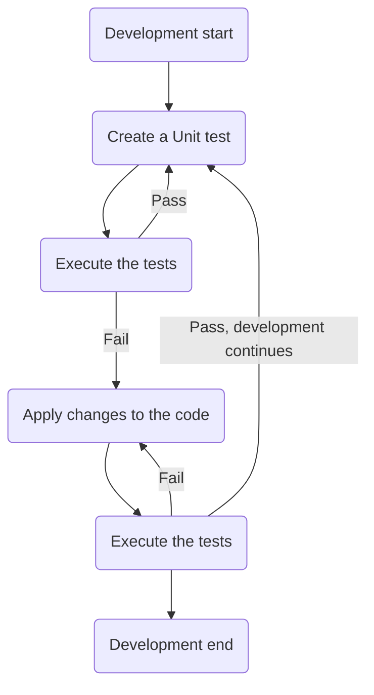
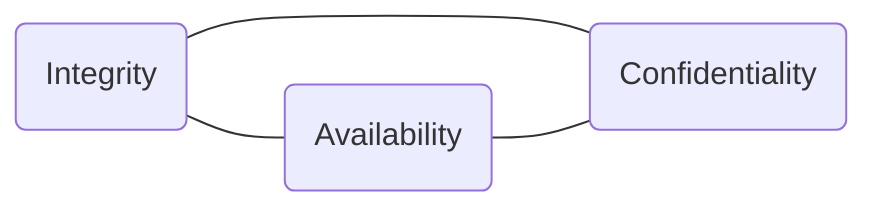
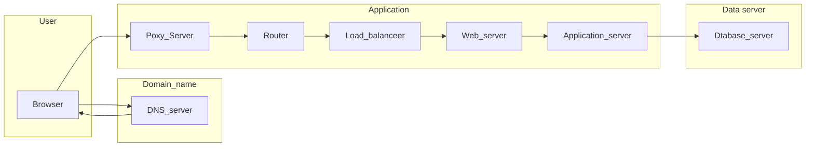
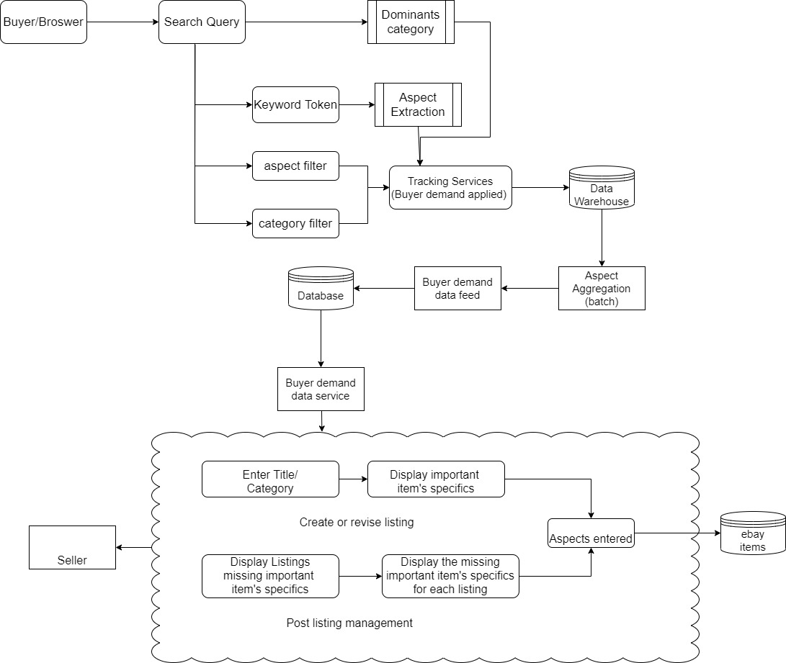
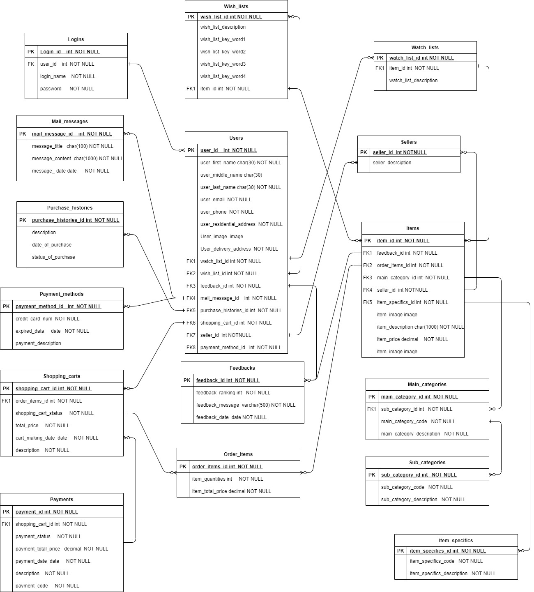

## T2A1-A - Workbook

### Description

This is an individual assignment accomplished by student cas022113 GuangJian Chen to  release a Request for Quotation for The ACME Corporation. The ACME Corporation tend to develop a marketplace web app with Rails. As an aspiring junior dev I need to produce a qualified **Rfq**.


### Questions

---

> **Q1. Describe the architecture of a typical Rails application.**

---

The MVC (Model/View/Controller) structural pattern is implemented by Rails and help to build the structure of web application.

```mermaid
   flowchart  LR;
   Browser<-->WebServer;
   WebServer-->Routing;
   Routing-->Controller;
   Controller-->View;
   Controller <--> Model;
   View-->WebServer;
   Model<-->G[(DataBase)]
  
  ```

There are 6 fundamental elements in a standard Ruby on rails web application.

- Models
Models are an significant kernel of target business which represent business domain within Ruby language. The model contains and implement business logic to interact with storage in the database. More precisely， actions like methods helps deliver memory-resident state of a model instance into the database. With models, developer can access to and manipulate the data in rails console by only accessing the models of the application.

 ```mermaid
   flowchart  LR;
   Model <--> G[(DataBase)]

 ```


- Routes

  The routes directs application to talk to specific URL and maps corresponding controller action to the requests through different HTTP verb such as GET, POST, Put and DELETE.

  In the application directory , config/routes.rb will contains all the routes which needed to specify the HTTP verb and follows by the path of URL and then what controller and actions to handle corresponding requests.

  ```
  get '/products/:id', to: 'products#show'
  ```
  As the example above, the **Get** is HTTP request and **'/products/:id'** is the URL route that application looking for and then following by corresponding controller **products** with **show** action.

- Rails Server
  The Rails server is an executable web server which can obtain requests from the user browser. When user types ***http://0.0.0.0:3000/*** in the browser which includes an IP address and Port 3000, the Rails server will listen to that IP and Port and assign the processing  to different components . Additionally, meaningful logs could be written in the log folder.

- Controllers
  
  ```mermaid
   graph LR
   controller#action --1-->model;
   model --4--> controller#action
   model --2--> G[(DataBase)];
   G[(DataBase)] --3--> model;
   controller#action --5--> View

  ```
  In Rails, every controller is implemented as a Ruby ActionController class with actions as public methods inside.  
  From the above diagram, we can see the process:
  1. To dealing with a request, controller need to ask for help from one of its action inside.
  2. Model communicates with database to ask for specific data or try to manipulate some data.
  3. SQL commands are executed on database and data is return to model.
  4. Model pass the data to controller.
  5. Instantiating object of the controller with corresponding action will be rendered by View.

- Views

  Views are accountable for informing  with Rails about the content of the HTML which is related to the request and the HTML will be send to the broswer to be displayed. Still, views rely on the data return by corresponding controller and action. Also a layout which is part of HTML markup is needed and the views content will sit inside the layout accordingly. 

- Assets
  Normally, assets are JavaScript, CSS code and any other media file such as audio, image, etc. Assets are accompany view content in a layout and all being sent to the browser.

---

> **Q2. Identify a database management system (DBMS) commonly used in web applications (including Rails) and discuss the pros and cons of this database.**

---

DBMS is the database program that  employs methods of indexing, hoarding, retrieving, and running queries on data. It offers a user interface to manager and modified the data with its database engine and schema. It also allows other program to manager data with help from DBMS.

Base on different standards, DBMS are categorized into relational, distributed, hierarchical, object-oriented, and network type. And MySQL is one of relational database management systems (RDBMS). It has the following pros and cons:

Pros

1. Practicability
Among many choices of relational database, some higher end products like Sql Server and Oracle are complicated and of industry level and requires professional training to operate with. Some lower end products such as light weight or embeddable database like SQLite are running with little to no integration or configuration overhead. 
&nbsp;
MySQL balances both side. It has rich features and ease of use at the same time. It’s been tested with a wide range of different compilers and working on numerous platforms like Oracle Linux, Canonical and Various Linux.For ease of use, you can use command line to deal with most of the tasks. The utility mysqldump is useful and not difficult to implement with when you try to import and export data. Due to the simply and compact architecture of the database in MySQL, you don’t need to spend massive of time to learn how to use it with command line.Clients are provided for almost all programming languages.
&nbsp;
2. Open source 
MySql is free to use and you can tailor its source code to meet your needs. It can reduce some cost on implementing your projects.
&nbsp;
3. Portability
 It can run on different platforms like Oracle Linux,   Canonical and Various Linux, and supports different languages like C, C++, PHP, JAVA and Python. If you want to target multiple platforms specifically web application, then MySQL is a great option. As a matter of fact, MySQL is a part of the famous LAMP (Linux Apache MySQL PHP) server stack which is widely accepted for web application development.
&nbsp;
4. Data Security
Complex encryption algorithms are applied on all password traffic when it comes to connecting to MySQL server. And the privilege and password system has good reputation on data security and it allows host-based verification. 
&nbsp;
5. Scalability
MySQL can assist the management of deeply embedded apps with smaller footprint, even in large databases contain millions records. It allows complete customization on different businesses with special database server requirements.
&nbsp;
6. Great performance
The core design of MySQL is make it fast to get data in and out as well, even it offset some other features because speed is vital in database management system. MySQL overall has better performance on basic queries which are regular used.

Cons

1. Not fully support standard SQL
While MySQL didn't uphold some standard SQL features like SQL check constraints, it might prone to data corruption and have problem on migration from MySQL to other databases.
&nbsp;
2. Limited Stored procedure and trigger
When it comes to write stored procedure and trigger which provide code reusing and encapsulation, MySQL has limited options comparing to another RDBMS like Postgresql.
&nbsp;
3. Hard to scale
MySQL doesn't support some modern database features like ROLE and COMMIT. And it cause lower performance.
&nbsp;
4. High memory requirement
High memory requirement can lead to difficulty on debug and data maintenance.
5. Performance on large sized data
Compare to the performance on large siz./ed database with PostgreSQL, MySQL is not efficient and working well enough.

---

> **Q3.	Discuss the implementation of Agile project management methodology.**

---

Compare to traditional software development process like waterfall which relies on massive  planning at the beginning  stage of the project to identify clear objectives and send them through fixed stages, Agile project management is a product thinking that’s based upon getting a move on, releasing often, and learning from your targeted users. 

Agile is a development process that uses sprints (short cycles) to enable someone to focus on building and continuous improve service or product.

1. Clear project project vision and scope
To get started with a new Agile project, a planning meeting with relevant members in teams is the priority. The business goal of the project has to be clarified. The meeting should identify who the target customers are, what key product benefit is for target customers, what the challenge is in development, what the main competitive alternative is and how do the team achieve the goal in a realistic way and always be flexible and adapt to feedback.
&nbsp;
2. Product road-map
   
```mermaid
  graph TB;
  subgraph For_each_Goal
  direction LR
        Time_frame
        Goal_Description
        Execution_plan
        Target_features
        Status_markers
        Metrics 
 end;
 ```
 ```mermaid
 graph LR;
 Goal_A-->Goal_B;
 Goal_B-->Goal_C;
 Goal_C-->Goal_D;
 ```
The vision in the meeting should be turn into a product road-map. In the goal-oriented product road-map diagram, we can see that under each goal content, goals, objectives, and outcomes would be boiled down to to specific aspect such as acquiring customers and increasing engagement and focus on execution plan for that goal and around three features attach to each goal. And a time-frame which is an important factor for speculating how much time and effort on each piece of product is applied.Status markers are for tracking the progress of work. Metrics help measuring data-driven goals.
&nbsp;
3. Create a release plan
Agile projects will have many releases of product, so that a time-oriented plan is needed for each release. you’ll prioritize the essential features to launch first. Get feedback and fix the problem in the period of each “sprints”.
&nbsp;
   
```mermaid
  graph TB;
  subgraph Sprint
  direction LR
        Sprint_planning-->Implementation
        Implementation-->Review
        Review-->Retrospective-->
        Sprint_planning
         
 end;
 ```
4. Sprint planning

And the following is about the planning “sprints”—short cycles period in development in which specific jobs and tasks will be completed.

A list of backlog items which are considered could be completed in that time-frame are created in the current sprint. Items may be refined during this process in which understanding and confidence is growing. For each backlog item, planning on how the item can be get done is necessary.
&nbsp;
5. Implementation with daily scrum
When implement the sprint plan, the daily scrum which optimizes the possibility that make sure the Team will meet the Sprint Goal. During the daily scrum the team members discuss on what they have done, what the job of today is and the barricades in work.
&nbsp;
6. Sprint reviews
At the end of each sprint, the project is assessed against the sprint goal which is created at the planning stage.The intention of the review is to examine the outcomes of the sprint, make sure everything on track and establish future alterations.
&nbsp;
7. Sprint retrospective and iterate to next sprint
Make sure digging in with sprint retrospective which recall previous sprint process. What can be improved, what is the feedback, how can I get the job done more efficiently, all of this questions and answers will make next iteration of sprint and release better. Iteration of sprint is the important essence of Agile project management and the learning from last sprint will benefit the next sprint.

---

> **Q4.	Provide an overview and description of a standard source control workflow.**

---

Source control is the practice of tracing and handling changes to source code. It  enables many developers to work on a single project at the same time. Each developers can change edit their own copies and decide when to share those copies with the rest team member. So that the content of each developer's work won’t meddle in other’s work. It also integrates the finished work together by different persons in team. And it provide access to versions of the project of history.

There are two varieties of source control: centralized and distributed. And I am going to select distributed source control flow which is less prone o errors and running faster as the situation of ACME Corporation being considered in the practice. 

 ```mermaid
 graph TB

        
 subgraph Server
        MainRepository
 end
 MainRepository--pull-->Repository1;
 MainRepository--pull-->Repository2;
 MainRepository--pull-->Repository3;


 subgraph Group1
        Repository1
        CopyOfOwnWork1
        Repository1--update-->CopyOfOwnWork1
        CopyOfOwnWork1--commit-->Repository1
 end
 subgraph Group2
        Repository2
        CopyOfOwnWork2
        Repository2--update-->CopyOfOwnWork2
        CopyOfOwnWork2--commit-->Repository2
 end
 subgraph Group3
        Repository3
        CopyOfOwnWork3
        Repository3--update-->CopyOfOwnWork3
        CopyOfOwnWork3--commit-->Repository3
 end
 Repository3--push-->MainRepository;
 Repository2--push-->MainRepository;
 Repository1--push-->MainRepository;     

```
First, Using `git pull` to fetch copy from main repository to your own local repository. And then using `git checkout -b <branch-name>` to check one new branch for one specific task which has been discussed with team member. Changes related to this task are made . And then Examine and test the local edits with `git status` and `git diff`. After ensuring the passed test, using `git add` and `git commit` with reasonable commit message to save the changes to current branch. Using `git reset` to rollback the changes to specific commit if needed.And then using `git checkout master` and `git merge <branch-name>` to merge the branch to master. Then using `git push` to upload the changes to main repository. If you want to see other member's work, pull request is needed to apply on main repository to fork a copy in own repository.

To achieve best practice of distributed source control, some rules are applied as follow:****

1. Ensure one commit reflects a single purpose such as a fixing of a specific bug or particular task. Small commits make it easier for other team member to understand the content and roll them back if something need to be identified.
   
2. Commit Messages should be Reasonable, short and descriptive. So that others can easily know what and why.
   
3. Developer should test the changes before commit to ensure no side effects or bugs left for other team member to handle.
   
4. Incorporate others' changes and share your changes frequently.

---

> **Q5.	Provide an overview and description of a standard software testing process (e.g. manual testing).**

---

Test-driven development  is a software development practice which focuses on writing unit test cases before production code to specify and validate what the code will do. In TDD, small test cases for every feature derive from their initial understanding. The main purpose of this technique is to modify new code only if the tests fail.  This avoids duplication of code. Moreover, it’s a structuring practice that enables developers gain optimized code that proves to be reliable in the long run.


From the flow chart above, we can see that TDD development process consists of many iterations and each iteration starts with a unit test to verify the functionality of specific features. The test is run and bound to fail at the beginning. But the failure is meaningful because developer can refactor the code as the test reflect what the purpose of the test and what the feature should behave.

Once a test fails, minimal changes and refactoring are applied to the code until it can run successfully to pass the test. These refactoring enhance overall performance of our code.

After successfully past the test, then we can start next iteration of TDD with next unit test focus on another small task. We just repeat the iterations on and on until the end of development.

---

> **Q6.	Discuss and analyse requirements related to information system security and how they relate to the project.**

---




The C-I-A Security Triad diagram displays the center concepts of information security -confidentiality, integrity, and availability. These three components guide informal security measures, controls, and overall strategy. 

1. Confidentiality. 
Confidentiality is about the ability to maintain the access control and ensuring that information is read, access, or change by someone authorized to do so.
&nbsp;
For ACME project, each private information such as credit card numbers, or trading secrets needs controls to decide who can view it and who can edit it.
&nbsp;

1. Integrity.
Integrity is about how to avoid unauthorized information modification or destruction. Unauthorized changes which derived from either intentional tampering or human error will produce inaccurate and incorrect information.
&nbsp;
For ACME project, inaccurate data and information will cause a lot of big financial, marketing and management problems. Such as incorrect bank account number will terminate the paying process and someone just can’t get the money they should get. Wrong phone number lead to unable to contact specific customer.  Data and information should changed only in a specified and authorized manner during storage and transmission.
&nbsp;
3. Availability
Availability is the ability to ensure that systems, information, and services are timely and uninterruptedly available  to those who have right of access. There are non-malicious threats such as unscheduled software downtime , hardware  aging issue  and malicious threats such  as cyber attack for denying user access to system.
&nbsp;
For ACME project, it has to make sure all resource are available to authorized user or processes. Protect the application and system to avoid  being taken down by disruption of website availability such as the Denial of Service (DoS) attacks.

---

> **Q7.	Discuss common methods of protecting information and data and how you would apply them to the project.**

---

There are several common method for protecting data as following:
1. Encryption
A computer algorithm can reverse data content into an unreadable format with corresponding encryption keys. Encryption process protects personal and secret data from unauthorized access even if the data is compromised by making it unreadable without right encryption key. Any high-risk personal data such as name, email address and trading secret information like transaction data and detailed order data should be encrypted. I would utilize `attr_encrypted` gem to assist the the critical data encryption and decryption in the project. And `CookieStore`helper method in Rails  the `encrypted` cookie to secure the session data.
```ruby
  class User
    # invoke the `attr_encrypted`gem
    extend AttrEncrypted
    attr_accessor :name
    attr_encrypted :ssn, key: '256 bits key'

    def load
      # loads the stored data
    end

    def save
      # saves the :name and :encrypted_ssn attributes 
    end
  end

  user = User.new
  user.ssn = '333-33-3333'
  user.ssn # returns the unencrypted object ie. '333-33-3333'
  user.encrypted_ssn # returns the encrypted version of :ssn
  user.save

  user = User.load
  user.ssn # decrypts :encrypted_ssn and returns '333-33-3333'

```
&nbsp;
2. Access control
Access controls includes limiting physical assess to the space where the data storage hardware are located and digital access to any login entry. For the digital access in this project, authentication will be implemented to accurately identifying users before they have access to data to control what content they can view and/or change. For this project, gem `devise` is applied to assist building the authentication process and a sessions object in Rails assist application to sustain user-specific state to protect the data in session, while users be in contact with the application. Password for specific user will be encrypted with gem `devise`. Also authorization is important to apply different level of privilege to specific user. For the project, guest user can only view the public content and customer can only view and edit the content which he or she has a right on.
```ruby
class ApplicationController < ActionController::Base
  before_action :configure_permitted_parameters, if: :devise_controller?

  protected

  def configure_permitted_parameters
    devise_parameter_sanitizer.permit(:sign_up, keys: [:username])
  end
end

```

&nbsp;
3. Backups
Backup is a practical way to deal with data loss problem no matter it’s from human error or physical damage on hardware. For this project, backup management should be implemented regularly in seasonable time scale. And the backup data should be encrypted and be stored in physical storage media in a separate safe place.
&nbsp;
4. Masking password
In this project, I will use `devise` gem to mask the password when the application require entering password of specific user in case someone else peek over the shoulder.
&nbsp;
5. Session timeout setting
The longer time period of stay session login, the higher chance of cyber attacks on CookieStore Sessions such as session hijacking and session fixation.  `Timeoutable` and `SessionTimeoutController`  built-in helper of `devise` gem can help setting a reasonable time around 5 to 10 minutes for specific user to keep the session login.
```ruby
#add in the model
class User < ActiveRecord::Base
  devise :timeoutable
end
```
```ruby
#in the route
devise_scope :user do
  get "/check_session_timeout", to: "session_timeout#check_session_timeout"
  get "/session_timeout", to: "session_timeout#render_timeout"
end
```
---

> **Q8.	Research what your legal obligations are in relation to handling user data and how they can be met for the project.**

---

The Privacy Act 1988,(Privacy Act) which includes the Australia privacy principles(APPs), is the primary piece of Australian legislation protecting the handling of personal information and data. Unlike General Data Protection Regulation (EU Regulation), there is no conception of data "controller" under Australian privacy law. The privacy law consider every APP entity which receives personal information has its own separate privacy obligations under the Privacy Act and APPs.

There are some legal base required in the application running as following:

1. According to **APP 1** [^1], developer required to take necessary steps to apply practices, procedures, and systems to ensure the data protection. In this project, we need to identify and evaluate every possible privacy risk throughout each stage of information life-circle, including data collection, storage, use and destruction. And all the content should be informed to all team member and be documented to form a plan.
&nbsp;
And developers need to design security systems such as access control, authorization and authentication to protect personal information from misuse and loss. Also the systems help away from unauthorized access and alteration.
Because of the size of the project, conducting a Privacy Impact Assessment is a good practice before handling personal information. 
&nbsp;
Developers also need to design procedures for identifying privacy breaches, how to handle the breaches, the appropriate responding for customers’ complaints.
&nbsp;
1. According to **APP 1** as following:
> “An APP entity must have a clearly expressed and up to date policy (the APP privacy policy) about the management of personal information by the entity.”[^2]

In this project, a privacy policy will outline the following factors:
. What sorts of personal information the application will gather and maintain;
. How the application is going to collect and hold the data;
. Explain the purposes of the data use;
. Who and how a individual access specific data.
. How individual deal with data breaches.
&nbsp;
3. According to APP 3,  I will merely assemble personal information which is fairly needed for specific goal when develop the project to comply the principle.
&nbsp;
4. According to App 3.3 as following:
> “an APP entity may only solicit and collect sensitive information if the individual consents to the sensitive information being collected, unless an exception applies.”[^3]

&nbsp;
Consent is a critical factor in APPs that need to be considered seriously. In this project, Terms and conditions will be carefully written and displayed on the application interface to inform every possible visitor and gain agreement on possible activities in this project.

---

> **Q9.Describe the structural aspects of the relational database model. Your description should include information about the structure in which data is stored and how relations are represented in that structure.**

---

Relational databases subject to the relational data model.The relational data model provided a standard approach of representing and querying data which could be applied to any application. The forte of the relational database model is its use of tables which is an intuitive and flexible method to store and access structured information. Every table represents specific group of data and made up of rows and column. Each row in the table depicts a record with a unique ID which is the key. Each column of the table portrays one attribute of the data, and each record generally has a value for each attribute. All of these basic structures intuitively represent and build the relationships among data points.


From the schema chart we can see there are groups of table and the relationships between tables. Take customers table as an example, **Customers** represent as customers group in this table, the primary key as**PK** of customer id is compulsorily used to uniquely identify each customer in customers group. And Each row in the schema table represent each attribute and requirements for that attribute. Each customer as a person has first name, last name email and respectively login detail as attributes. Alsop a foreign key as**FK**is a attribute value in a group table that is required to match the attribute value of the primary key in another group table. The schema chart display this "**PK** and **FK**" relationship between groups as well. We can see Customers has a "**One to Many**" optional relationship which contains zero to Orders, meaning that one customer can make many orders while the unique order couldn't be own by many customers. Customers group also has **One to Many** optional relationship which contains zero to Customer_Payment_methods group while Customer_Payment_methods is a join table to associate Customers with Payment_Methods groups.

---

> **Q10. Describe the integrity aspects of the relational database model. Your description should include information about the types of data integrity and how they can be enforced in a relational database.**

---

From the schema chart of previous question, we can see that two integrity rules are applied to the schema chart to maintain the data integrity. 

1. Entity integrity
This rule emphasize each primary key within a table shouldn't be null and it has to be unique. This ensures that rest rows are all uniquely identified by the primary key. And it also ensure foreign key can properly refer to primary key. 

From one of the product group table we can see the primary key has a "**Not Null**" requirement and because of duplicated id not allowed in the table. Both reasons ensure all entities in the table must be distinguishable.
&nbsp;
2. Referential integrity
Referential integrity is a rule that if a value displayed in one relation for a given attribute, it should also appears for the certain attribute in another table.
Referential integrity constraint is required when a foreign key got a value which refers to a row of other table in another relation to maintain the consistency between the two relations. 

From the above diagram, we can see that the primary key "product_type" in Product_Types is referred to the foreign key "product_type" in Products. The Referential integrity constraint avoid mistakenly deleting the referential data and ensure the relations between tables can be safely maintained.
&nbsp;
1. Additional Constraints
There are some practical constrains for data integrity requirement as well. As for business or semantic purpose， such as price has to be decimal and couldn't be negative figure, the number of specific product has a limited amount of stock, the credit card number should comply to certain format, the email address format should follow certain conventions, all attributes have its own specific Constraints to ensure the data integrity.

---

> **Q11. Describe the manipulative aspects of the relational database model. Your description should include information about the ways in which data is manipulated (added, removed, changed, and retrieved) in a relational database.**

---

When developer want to communicate with database, the standard language of communication is Structured Query Language (SQL).  There are two kinds languages in SQL: Data Definition Language (DDL) and Data Manipulation Language (DML).
DDL uses commands like CREATE, DROP, ALTER when it comes to create and define the schema of a database. Use CREATE command to create a table in PostgreSQL as the following:
```
CREATE TABLE products (
product_id integer PRIMARY KEY,
product_type_id integer REFERENCES product_types,
product_name  text NOT NULL,
product_price numeric NOT NULL CHECK (product_price > 0),
product_weight numeric NOT NULLCHECK (product_weight > 0),
product_size numeric NOT NULLCHECK (product_size > 0),
product_detail text NOT NULL CHECK (char_length(name) <= 300)
);
```
In this example, the products table depicts product id, product type id, price, weight, size and detail description. And each attribute had certain constraints for itself. Integer describe the attribute as whole numbers. The **NOT NULL** means when inserting data, the corresponding attribute shouldn't be empty. The **PRIMARY KEY** identify the attribute is a must have attribute and unique in this table. while the **REFERENCES** means the relation with other table as a foreign key.

When it comes to working on real record in a table, such as select, update and delete data, DML is required.

```
SELECT *     
FROM product
WHERE product_price>=30
```

We can see the **SELECT** command to used to retrieve specific record in corresponding table. The content after the **FROM** specify which the table is for searching. And The **WHERE** command identify the conditions apply to the searching.


```
INSERT INTO product (product_name, product_price,
product_weight, product_size, product_detail)
VALUES (GEFORCE RTX 3060 TI, 1399, 2300, 2.53, 
"The latest iteration of GEFORCE RTX GAMING series");
```

From above we can see the **INSERT** command points out which the table is and what attributes content need to add. And the **VALUES** plus the contents of what we intend to add in the table will inform the table that developer want to add some to the table.

```
UPDATE product
SET product_name="GEFORCE RTX 3060"    
WHERE product_name="GEFORCE RTX 3060 TI";
```

The **UPDATE** command is used for replace the old value with new value in a table. The **SET** specify the new value of certain attribute of the product. And the **WHERE** identify which old value of corresponding attribute is.

```
DELETE FROM product
WHERE product_name="GEFORCE RTX 3060";
```

The **DELETE FROM** command intuitively stress developer want to delete something from specific table. And the **WHERE** distinguish particular record that meet the condition.

---

> **Q12. Conduct research into a marketplace website (app) and answer the following parts:  a. List and describe the software used by the app.
  b. Describe the hardware used to host the app.
  c. Describe the interaction of technologies within the app
  d. Describe the way data is structured within the app
  e. Identify entities which must be tracked by the app
  f. Identify the relationships and associations between the entities you have identified in part (e)
  g. Design a schema using an Entity Relationship Diagram (ERD) appropriate for the database of this website (assuming a relational database model).**
---

eBay is an online shopping website which is always connected buyers and sellers globally. It was found as online auction site and be accepted by many online traders as a sales channel. It means with its help, visitor can buy products and sell their own items.

> a. List and describe the software used by the app.

Server-Side:
. Secure Sockets Layer(SSL)
SSL is a cryptographic protocol  for securing an internet connection and safeguarding whatever sensitive information that is being dispatched among server side and client side, preventing unauthorized reading and modifying any transmitted information.

Client-Side
. Asynchronous JavaScript
JavaScript is an single threaded computer programming language which can be both applied on the client and server side. It also enable user to interact with web-page. With the asynchronous syntax in JavaScript, multiple tasks will be handled concurrently once the effect of each task is available. 

. Local Storage
Similar to session in Rails , localStorage is a method that assist JavaScript websites saving key-value pairs in browser.

Client-Side Scripting Frameworks
. D3.js
D3.js is a Visualisation JavaScript library for documents manipulation in accordance with data.

Web Stats
. Google Webmaster Tools
Google Webmaster Tools are tools that allowing webmasters to check indexing status and improve search engine optimization(SEO) on Google.

Doctype
. HTML5
HTML5 is latest version of the HTML standard and the primary markup language on the web.

Web Browser Targeting
. Content Security Policy
This policy is for detecting and mitigating attacks in the browser.

. Strict Transport Security
It's a security policy mechanism for website by which a web server announces that consenting user agents are to communicate with it only with secure HTTP connections.

HTTP Compression
. Gzip Content encryption
This protocol which is built-in protocol in web servers and  it helps web surfers to make better use of capability of bandwidth and improve transfer speeds.

Database program
. MongoDB
MongoDB is introduced in ebay to carry out many tasks that involve a huge volume of data.
&nbsp;
> b. Describe the interaction of technologies within the app.

Ebay have different servers hosting its own web app in different country and region. The domain name of Ebay is **EBAY.COM.AU** in Australia. And the web hosting service fro **https://www.ebay.com.au** is being provided by a company named **Akamai Technologies** which offer content delivery network (CDN) services in United States. While the CDN services rely on large distributed system of servers deployed in many data centers, ebay can successfully host the app. The resent hosting server of **https://www.ebay.com.au** is located at "***Akamai Technologies, Inc. 145 Broadway Cambridge MA US 02142***". The ebay server's IP is 88.221.42.201. The Name Server of [ebay](https://www.ebay.com.au) is dns1.p06.nsone.net. The IP address of this ebay proxy-server is 104.96.81.116. And the Operating System of this server is Linux. [^4]

> c. Describe the interaction of technologies within the app.

Users interacts with ebay via browser with graphical user interface as font end. Just like most of website application, the font end website of ebay is integrated by HTML5, Cascading Style Sheets and JavaScript to produce vivid interface. While user interacts with browser, ebay use Local Storage to save relevant key-value pairs information like username in the sessions of the browser which will ease the burden of the server at back end. When **https://www.ebay.com.au** is typed in the browser, ebay will used Domain Name System to fetch IP address from a Name Server. 

Ebay also provide an Application Program Interface (API) with D3.js Visualization Library to developers to built applications via fetch data from ebay API. When the requests being sent through the back end servers, Gzip Content Encoding as a compression protocol is implemented by ebay to reduce the size of data packet and enhance the efficiency when transmitting information. To ensure the security when user interacts with ebay in a browser, ebay use Content Security Policy and Strict Transport Security and other Web security policy mechanisms to detect and mitigate cyber attacks. Ebay select MongoDB as its database management system to manipulate and manage data in a database. 

Requests which be sent from a browser arrives proxy server first. The proxy servers cache repeatedly visited web pages so that users can retrieve them without wasting time on accessing to website. Also ebay chooses Secure Sockets Layer and its successor for building authenticated and encrypted links between devices in network.


> d. Describe the way data is structured within the app.


The above diagram displays how data flows through the application. When buyers search for listings, their queries are examined and be separated into into structured signals allows buyer demand to be seized by downstream systems. Specifics of items are pulled out of the keywords based on former searches and buyer history searching. The procedure also includes factoring in extra filters chosen by the buyer.

For example, from evaluating the query of “Asus Nvidia Geforce 2GB GT 1030 Graphic Card DDR5,” we can identify the intention of buyer is searching for Brand = “Asus ”, Chipset Manufacturer = “Nvidia” , Chipset/GPU Model=”Nvidia Geforce 2GB GT 1030”, Memory Size=”2G” and Memory Type = “DDR5” in the “Graphics card” category.

These signals are pursued and saved in a data warehouse and processed as aggregated demand afterwards. Then the demand is delivered to transferable systems as a feed for simultaneous advice to sellers around crucial item details which they should provide.

The simultaneous advice includes displaying buyer demand data to sellers at the same time of creating or revising a listing. And high-demand item specifics will be exposed to seller more frequently to improve engagement with seller. This is implemented through the “Buyer Demand Data Service” in Figure 2, which aims to provide the demand data and critical specifics of items throughout the selling adventures. The listing creation method and the post-listing management procedure are integrated for providing advice on existing listings which lack important item specifics to seller.

Seller will know what is more popular among buyer and try to provide more items to meet that aspect to earn more profit and engage more intensely with the ebay, eventually producing high-grade listings that promote sales.

> e. Identify entities which must be tracked by the app.

1. Logins
This entity has username, password and email information.

1. Users
This entity has personal detail information such as name, address, email and more.

1. Sellers
This entity is part of the user and deals with selling product.

1. Shopping carts
This entity contains all the items for buying.

1. Items
This entity has details information, specific attributes, image, category and more.

1. Order items
This entity contains the quantity of the certain item. 

1. Main categories
It contains all the main categories of items.

1. Sub-categories
It contains all the sub-categories of items.

1. Item specifics
It contains all the specifics key word to describe the item.

1. Categories
This entity provides connections between products and group the product for efficient searching.


1. Purchase histories
It contains the history information of buying items.

1. Payments
It contains payment detail information such as price should pay.

1.  Mail messages
It has all the messages from application or other users.

1. Feedbacks
It contains the feedback for specific items from specific seller.

1. Watch lists
It contains a list of items that require frequent surveillance.

1. Wish lists
It contains keyword or description of specific item to help seller to promote engagement.

1. Payment methods
It contains different paying methods of a user.

> f. Identify the relationships and associations between the entities you have identified in part (e).

Logins has one to many optional relationship with Users.

User has one to many optional relationship with Mail messages, Purchase histories, Payment methods, Shopping carts, Wish lists, Watching lists, Sellers and Feedback entities.

Wish lists and Watching lists both has one to many optional relationship with Items.

Items has one to many optional relationship with Sellers, Item specifics, Main categories, Feedbacks and Order items.

Main categories has one to many optional relationship with Sub-categories.

Shopping carts has one to many optional relationship with Order items.

Payments has one to many optional relationship with Shopping carts.

> g. Design a schema using an Entity Relationship Diagram (ERD) appropriate for the database of this website (assuming a relational database model)




[^1]: See https://www.oaic.gov.au/privacy/australian-privacy-principles-guidelines/chapter-1-app-1-open-and-transparent-management-of-personal-information
[^2]: see [Australian Privacy Principles Guidelines 1](https://www.oaic.gov.au/privacy/australian-privacy-principles-guidelines/chapter-1-app-1-open-and-transparent-management-of-personal-information)
[^3]: See [Australian Privacy Principles Chapter 3: APP 3 — Collection of solicited personal information](https://www.oaic.gov.au/privacy/australian-privacy-principles-guidelines/chapter-3-app-3-collection-of-solicited-personal-information)
[^4]: See [Site report for https://www.ebay.com.au](https://sitereport.netcraft.com/?url=https%3A%2F%2Fwww.ebay.com.au%2F)